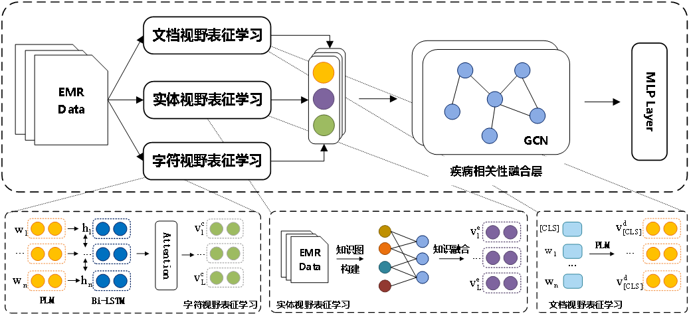

# MVRLN

Repository for paper "Multi-view Representation Learning Network Based on Knowledge Augmentation for Auxiliary Diagnosis"

Requirement:
======

	Python: 3.6
	PyTorch: 1.6.0

Data Format:
======

.json  
`[ {
        "病历编号": "",  
        "性别": "",
        "年龄": "",
        "主诉": "",
        "现病史": "",
        "出院诊断": [],
        "药品标签": [],
        "疾病实体": [],
        "治疗实体": [],
        "检查实体": [],
        "原始诊断": [],
        "原始治疗": []
    },...]`

label2id.txt
`
高血压
糖尿病
...
`

'train.json' 'dev.json' 'test.json', 'label2id.txt' to `Data\split_data\`

Run
====

``` 
    # 下载预训练模型
    cd pretrain_language_models/bert_chinese
    sh download.sh
    cd ../Erlangshen-Longformer-110M
    sh download.sh
    cd ../ernie-health-zh
    sh download.sh
    cd ../..
    # 数据处理
    python preprocess.py
    # 训练和测试
    sh run_main.sh
```

Models
=====



